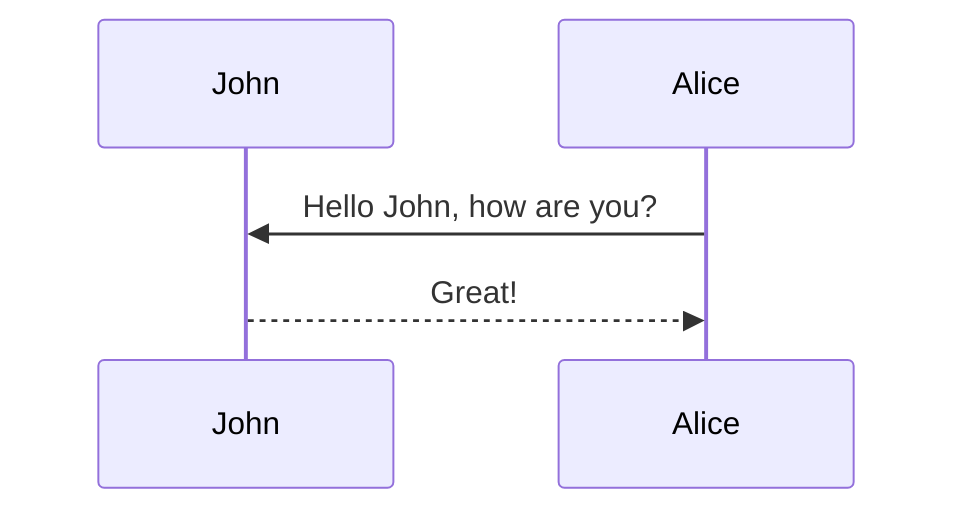

This theme supports generating various diagrams from a text description using [mermaid](https://mermaid-js.github.io/mermaid/){:target="\_blank"}. Previously, this was done using the [jekyll-diagrams](https://github.com/zhustec/jekyll-diagrams){:target="\_blank"} plugin. For more information on this matter, see the [related issue](https://github.com/alshedivat/al-folio/issues/1609#issuecomment-1656995674). To disable the zooming feature, set `mermaid.zoomable` to `false` in this post frontmatter.

## Mermaid

The diagram below was generated by the following code:

````markdown

````


For adding charts, checkout the [[2024-01-26-echarts]] post. Additionally, refer to [[2023-12-12-tikzjax]] for creating svg images from `tikz` library.